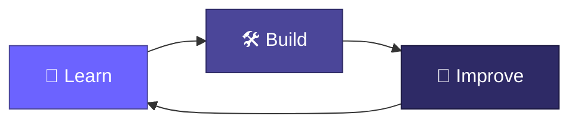

<div align="center">


</div>

<br/>

<table align="center" width="100%">
<tr>
<td width="100%">

```
┌──────────────────────────────────────────────────────────┐
│  whoami                                                   │
│  ───────                                                  │
│  Rowshon Jahan Poddo                                      │
│  CSE Student & Developer                                  │
│  Based in Bangladesh                                      │
│  Focused on Web Development & Software Engineering        │
└──────────────────────────────────────────────────────────┘
```

</td>
</tr>
</table>

<br/>

##  A little about the mindset

Every line of code here follows a simple loop — not a one-time achievement, but a continuous cycle.



<sub>No shortcuts, no plateaus — just the next iteration.</sub>

<br/>

<div align="center">

### ⟡ ⟡ ⟡

</div>

<br/>

## 📍 Currently

<table width="100%">
<tr>
<td width="50%" valign="top">

**Field of focus**
Web Development & Software Engineering — building an understanding of how real software gets designed, structured, and shipped.

</td>
<td width="50%" valign="top">

**Academic track**
Studying Computer Science & Engineering (CSE), turning coursework into practical, hands-on experience.

</td>
</tr>
</table>

<br/>

<div align="center">

### ⟡ ⟡ ⟡

</div>

<br/>

## 📊 GitHub, in numbers

<div align="center">


<br/>


</div>

<sub align="center">These cards refresh automatically — a live, honest snapshot rather than a fixed claim.</sub>

<br/>

<div align="center">

### ⟡ ⟡ ⟡

</div>

<br/>

## 🤝 Let's connect

<div align="center">

<a href="https://github.com/YOUR_USERNAME">
  
</a>
<a href="YOUR_LINKEDIN_URL">
  
</a>

</div>

<br/>

<div align="center">


</div>

<br/>

<div align="center">

<sub>Learn → Build → Improve — and repeat.</sub>

</div>
